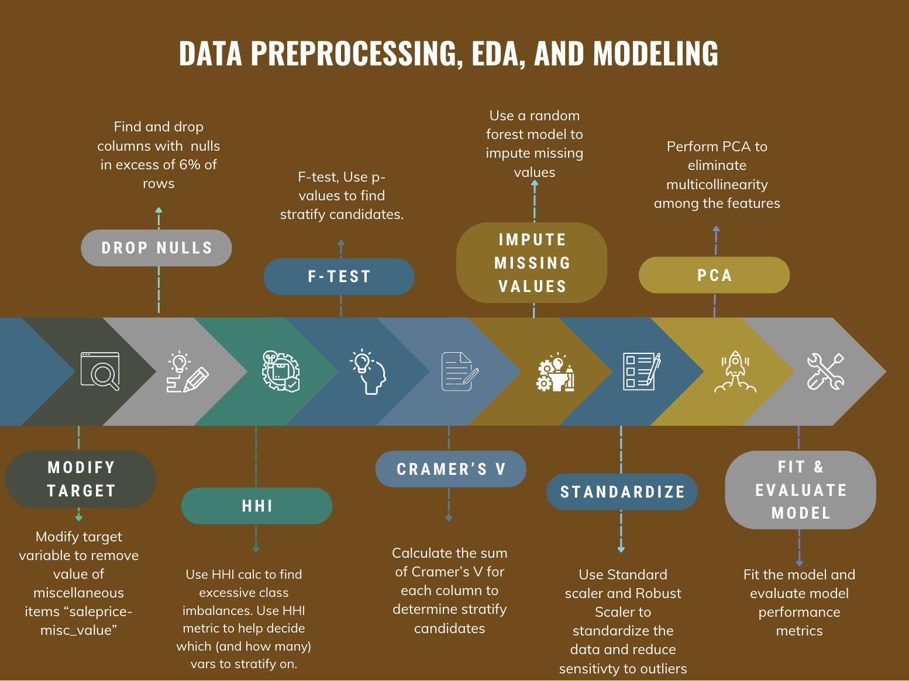

Nicholas Sanso  
Oct 4, 2023  

# **Housing Price Predictor**

## Table of Contents:
1. [Background and Problem Statement](#section-title)
1. [Modeling Theory](#section-title)
1. [Research Approach](#section-title)
1. [Data Description](#section-title)
1. [Data Dictionary](#section-title)
1. [Model Performance](#section-title)
1. [Conclusions](#section-title)
1. [Next Steps](#section-title)

## [Background and Problem Statement](#section-title)  
Create a model that will predict the sales price of housing in low and medium density residential areas of Ames, Iowa.

## [Preprocessing, EDA, and Modeling](#section-title)
1. Drop indexes that are of different types of housing and drop columns that have more than 6% of rows that are empty
2. Calculate the HHI of the feature calculating the HHI by treating each subcategory's percentage share as if it were a firm's share in the industry. Calculate the F-Test to see if the feature has a statistically significant relatinoship with the dependent variable. Calculate the sum of a feature's Cramer V with all the other features to get a single statistic that represents its correlation with all  other categorical variables. Use these three metrics to prioritize which categorical vairables to include in the model
3. Impute the missing vlaues of features with less than 6% missing using a Random Forest model.
4. Standardize all the features and PCA the highly correlated ones
5. Fit and evaluate the model.

## [Data Description](#section-title)
The target variable is sales price with the value of miscelaneous items removed. 
The data consisted of 78 features and 2051 observations: 
1. Most features described characteristics at the "asset level of detail" (attributes specific to the property) 
2. High correlations existed between many features   
3. No industry level or macro economic level features (such as interest rates or unemployment) were included  

## [Data Dictionary](#section-title)

| Feature | Description |
| --- | --- |
| **SalePrice** | The property's sale price in dollars. This is the target variable that you're trying to predict for this challenge. |
| **MSSubClass** | The building class |
| **MSZoning** | Identifies the general zoning classification of the sale.
| **LotFrontage** | Linear feet of street connected to property |
| **LotArea** | Lot size in square feet |
| **Street** | Type of road access to property |
| **Alley** | Type of alley access to property |
| **LotShape** | General shape of property |
| **LandContour** | Flatness of the property |
| **Utilities** | Type of utilities available |
| **LotConfig** | Lot configuration |
| **LandSlope** | Slope of property |
| **Neighborhood** | Physical locations within Ames city limits |
| **Condition1** | Proximity to main road or railroad |
| **Condition2** | Proximity to main road or railroad (if a second is present) |
| **BldgType** | Type of dwelling |
| **HouseStyle** | Style of dwelling |
| **OverallQual** | Overall material and finish quality |
| **OverallCond** | Overall condition rating |
| **YearBuilt** | Original construction date |
| **YearRemodAdd** | Remodel date (same as construction date if no remodeling or additions) |
| **RoofStyle** | Type of roof |
| **RoofMatl** | Roof material |
| **Exterior1st** | Exterior covering on house |
| **Exterior2nd** | Exterior covering on house (if more than one material) 
| **MasVnrType** | Masonry veneer type |
| **MasVnrArea** | Masonry veneer area in square feet |
| **ExterQual** | Exterior material quality |
| **ExterCond** | Present condition of the material on the exterior |
| **Foundation** | Type of foundation |
| **BsmtQual** | Height of the basement |
| **BsmtCond** | General condition of the basement |
| **BsmtExposure** | Walkout or garden level basement walls |
| **BsmtFinType1** | Quality of basement finished area |
| **BsmtFinSF1** | Type 1 finished square feet |
| **BsmtFinType2** | Quality of second finished area (if present) |
| **BsmtFinSF2** | Type 2 finished square feet |
| **BsmtUnfSF** | Unfinished square feet of basement area |
| **TotalBsmtSF** | Total square feet of basement area |
| **Heating** | Type of heating |
| **HeatingQC** | Heating quality and condition |
| **CentralAir** | Central air conditioning |
| **Electrical** | Electrical system |
| **1stFlrSF** | First Floor square feet |
| **2ndFlrSF** | Second floor square feet |
| **LowQualFinSF** | Low quality finished square feet (all floors) |
| **GrLivArea** | Above grade (ground) living area square feet |
| **BsmtFullBath** | Basement full bathrooms |
| **BsmtHalfBath** | Basement half bathrooms |
| **FullBath** | Full bathrooms above grade |
| **HalfBath** | Half baths above grade |
| **Bedroom** | Number of bedrooms above basement level |
| **Kitchen** | Number of kitchens |
| **KitchenQual** | Kitchen quality |
| **TotRmsAbvGrd** | Total rooms above grade (does not include bathrooms) 
| **Functional** | Home functionality rating |
| **Fireplaces** | Number of fireplaces |
| **FireplaceQu** | Fireplace quality |
| **GarageType** | Garage location |
| **GarageYrBlt** | Year garage was built |
| **GarageFinish** | Interior finish of the garage |
| **GarageCars** | Size of garage in car capacity |
| **GarageArea** | Size of garage in square feet |
| **GarageQual** | Garage quality |
| **GarageCond** | Garage condition |
| **PavedDrive** | Paved driveway |
| **WoodDeckSF** | Wood deck area in square feet |
| **OpenPorchSF** | Open porch area in square feet |
| **EnclosedPorch** | Enclosed porch area in square feet |
| **3SsnPorch** | Three season porch area in square feet |
| **ScreenPorch** | Screen porch area in square feet |
| **PoolArea** | Pool area in square feet |
| **PoolQC** | Pool quality |
| **Fence** | Fence quality |
| **MiscFeature** | Miscellaneous feature not covered in other categories 
| **MiscVal** | $Value of miscellaneous feature |
| **MoSold** | Month Sold |
| **YrSold** | Year Sold |
| **SaleType** | Type of sale |
       
## [Model Performance](#section-title)
| Metric | Value |
| --- | --- |
| **R^2** | .7715
| **cross_val_score** | .7568
| **cross_val_scor_std** | .0456
| **RMSE** | $38,396 

## [Conclusions](#section-title)
1. The model explains 77.15% of the variation in the dependent vaiable (saleprice).
2. PCA components have very low correlation with other features
 

## [Next Steps](#section-title)
1. Upsample to stratify on and incorporate a larger number of categorical variables
2. Stratify and encorporate different categorical variables
3. Fit a model that utilizes regularization 

    
    
   
    
    

 
